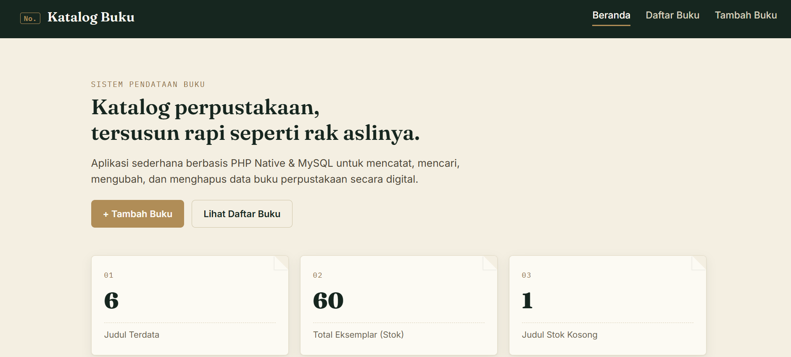
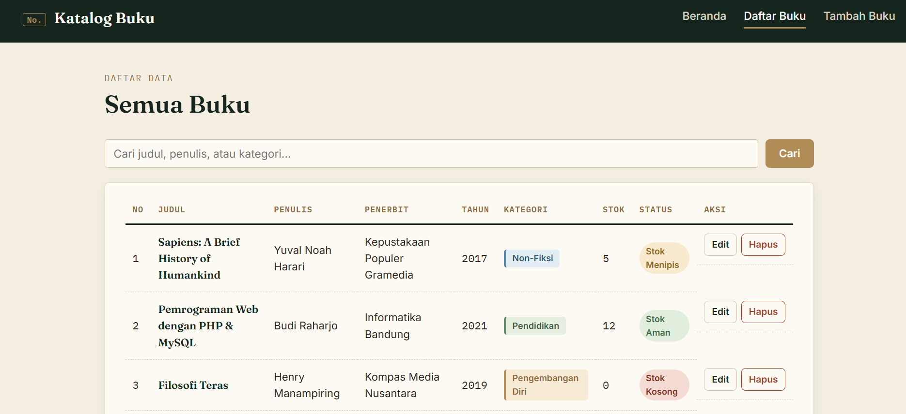
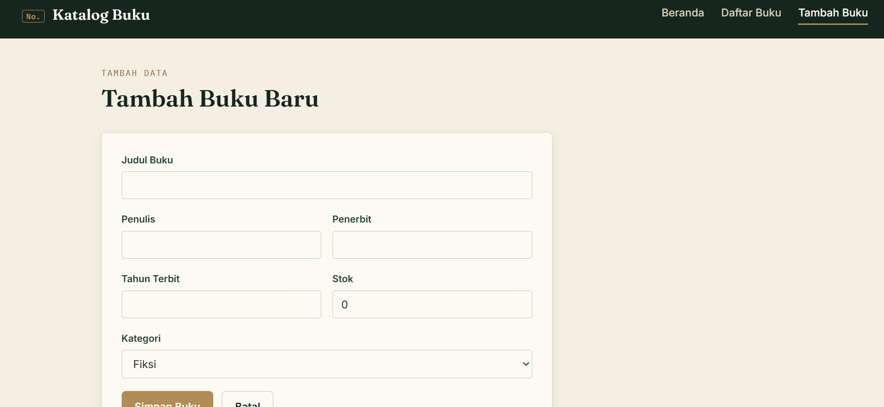
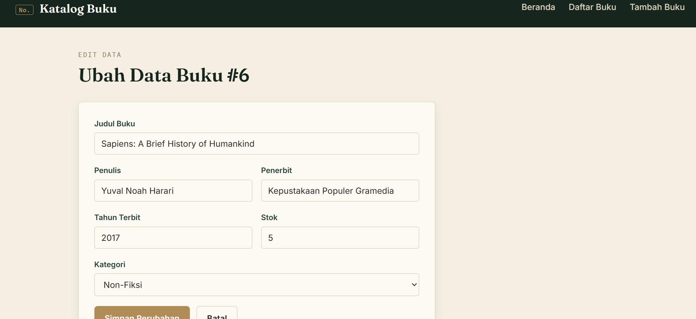

# Sistem Pendataan Buku


## 1. Identitas

| Keterangan | Isi |
|---|---|
| Nama | Nur Azizah |
| NIM | 240631100100 |
| Judul Aplikasi | Sistem Pendataan Buku |
| Mata Kuliah | Pemrograman Web |

## 2. Deskripsi Singkat

Aplikasi web sederhana untuk mengelola data katalog buku perpustakaan. Aplikasi ini
dibangun menggunakan **HTML5, CSS murni (tanpa framework), PHP Native, dan MySQL**,
dengan fitur lengkap **CRUD (Create, Read, Update, Delete)**, pencarian data, validasi
form, serta tampilan responsif bertema "kartu katalog perpustakaan".

Fitur utama:
- **Beranda** — ringkasan statistik (total judul, total stok, judul dengan stok kosong).
- **Daftar Buku** — menampilkan seluruh data buku dalam bentuk tabel, dengan fitur
  pencarian (judul/penulis/kategori) via `GET`, serta tombol edit & hapus.
- **Tambah Buku** — form `POST` untuk menambah data buku baru, lengkap dengan validasi.
- **Edit Buku** — mengambil data lama via `GET` (`edit.php?id=...`), lalu memperbarui
  data via `POST`.
- **Hapus Buku** — menghapus data berdasarkan ID via `GET` (`hapus.php?id=...`).

## 3. Screenshot Aplikasi


```
contoh:
!(assets/screenshot-beranda.png)
!(assets/screenshot-daftar.png)
!(assets/screenshot-tambah.png)
!(assets/screenshot-edit.png)
```

## 4. Struktur Database

**Nama database:** `db_pendataan_buku`
**Nama tabel:** `buku`

| Kolom | Tipe Data | Keterangan |
|---|---|---|
| id_buku | INT, AUTO_INCREMENT | Primary key |
| judul | VARCHAR(150) | Judul buku |
| penulis | VARCHAR(100) | Nama penulis |
| penerbit | VARCHAR(100) | Nama penerbit |
| tahun_terbit | YEAR | Tahun terbit |
| kategori | VARCHAR(50) | Fiksi / Non-Fiksi / Pendidikan / Pengembangan Diri / Lainnya |
| stok | INT | Jumlah eksemplar tersedia |
| created_at | TIMESTAMP | Waktu data dibuat (otomatis) |

Struktur lengkap beserta 6 data awal tersedia di file [`database.sql`](database.sql).

## 5. Struktur File Project

```
UAS-PWEB-2526G-[NIM]/
├── index.php        # Halaman Beranda
├── daftar.php        # Halaman Daftar Data (Read + pencarian)
├── tambah.php        # Halaman Tambah Data (Create)
├── edit.php          # Halaman Edit Data (Update)
├── hapus.php         # Proses Hapus Data (Delete)
├── koneksi.php       # Koneksi ke database (mysqli)
├── functions.php     # Kumpulan function bantuan (di-include di semua halaman)
├── header.php        # Bagian atas HTML (di-include di semua halaman)
├── footer.php         # Bagian bawah HTML (di-include di semua halaman)
├── database.sql      # Struktur tabel + data awal
├── css/
│   └── style.css     # CSS eksternal
├── assets/            # Tempat menyimpan screenshot untuk README
├── img/
└── README.md
```

## 6. Cara Menjalankan Aplikasi

1. Pastikan sudah terinstall **XAMPP / Laragon** (Apache + PHP + MySQL).
2. Salin folder project ini ke dalam direktori `htdocs` (XAMPP) atau `www` (Laragon).
3. Jalankan Apache dan MySQL dari Control Panel XAMPP/Laragon.
4. Buka **phpMyAdmin**, lalu impor file `database.sql`
   (atau jalankan via terminal: `mysql -u root < database.sql`).
5. Sesuaikan kredensial database di `koneksi.php` jika diperlukan
   (default: `host=localhost`, `user=root`, `pass=` kosong).
6. Buka browser dan akses:
   ```
   http://localhost/UAS-PWEB-2526G-240631100100/index.php
   ```
7. Aplikasi siap digunakan — coba tambah, edit, cari, dan hapus data buku.

## 7. Pernyataan Penggunaan GenAI

> Proyek ini dikembangkan dengan bantuan AI (Claude) untuk membantu menulis kerangka
> kode PHP/CSS dan dokumentasi. Logika, struktur database, dan penyesuaian akhir
> ditinjau dan dipahami oleh mahasiswa yang bersangkutan.


